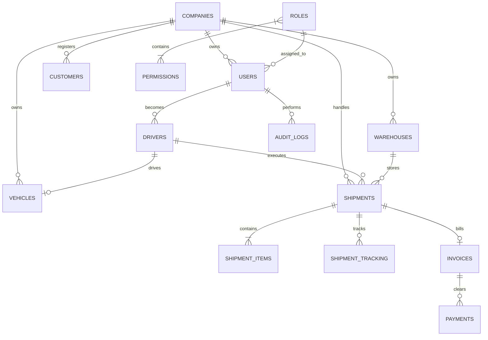

# LogiFlow - Database Design Specification

This document details the relational database schema design for the LogiFlow logistics system.

---

## 1. Relational Table Schemas

### 1.1 companies
Holds tenant configurations, legal data, and platform subscriptions.
* `id`: UUID (Primary Key, default: `gen_random_uuid()`)
* `name`: VARCHAR(255) (Not Null)
* `legal_name`: VARCHAR(255)
* `gst_number`: VARCHAR(50) (Unique, Nullable)
* `logo_url`: TEXT (Nullable)
* `subscription_status`: VARCHAR(50) (Default: 'trial', Not Null)
* `created_at`: TIMESTAMP (Default: `now()`, Not Null)
* `updated_at`: TIMESTAMP (Default: `now()`, Not Null)

### 1.2 permissions
System actions that can be authorized.
* `id`: UUID (Primary Key)
* `name`: VARCHAR(100) (Unique, Not Null) - e.g. `shipment:create`, `vehicle:assign`
* `description`: TEXT

### 1.3 roles
Tenant-specific or global user roles.
* `id`: UUID (Primary Key)
* `company_id`: UUID (Foreign Key references `companies.id`, Nullable for global roles like Super Admin)
* `name`: VARCHAR(100) (Not Null)
* `description`: TEXT
* `created_at`: TIMESTAMP (Default: `now()`)

### 1.4 role_permissions (Join Table)
Many-to-many relationship between roles and permissions.
* `role_id`: UUID (Foreign Key references `roles.id` ON DELETE CASCADE, PK)
* `permission_id`: UUID (Foreign Key references `permissions.id` ON DELETE CASCADE, PK)

### 1.5 users
Primary table for all authenticating identities.
* `id`: UUID (Primary Key)
* `company_id`: UUID (Foreign Key references `companies.id` ON DELETE CASCADE, Nullable for global Super Admins)
* `role_id`: UUID (Foreign Key references `roles.id` ON DELETE RESTRICT, Not Null)
* `email`: VARCHAR(255) (Unique, Not Null)
* `hashed_password`: VARCHAR(255) (Not Null)
* `full_name`: VARCHAR(255) (Not Null)
* `phone_number`: VARCHAR(50) (Nullable)
* `is_active`: BOOLEAN (Default: `true`, Not Null)
* `is_verified`: BOOLEAN (Default: `false`, Not Null)
* `created_at`: TIMESTAMP (Default: `now()`)
* `updated_at`: TIMESTAMP (Default: `now()`)

### 1.6 customers
Clients booking logistics operations.
* `id`: UUID (Primary Key)
* `company_id`: UUID (Foreign Key references `companies.id` ON DELETE CASCADE, Not Null)
* `name`: VARCHAR(255) (Not Null)
* `email`: VARCHAR(255) (Unique, Not Null)
* `phone`: VARCHAR(50) (Nullable)
* `billing_address`: TEXT (Not Null)
* `shipping_address`: TEXT (Not Null)
* `created_at`: TIMESTAMP (Default: `now()`)

### 1.7 vehicles
Transport vehicle assets owned by companies.
* `id`: UUID (Primary Key)
* `company_id`: UUID (Foreign Key references `companies.id` ON DELETE CASCADE, Not Null)
* `registration_number`: VARCHAR(50) (Unique, Not Null)
* `model`: VARCHAR(100) (Not Null)
* `type`: VARCHAR(50) (Not Null) - e.g. 'truck', 'van', 'bike'
* `capacity_kg`: NUMERIC(10, 2) (Not Null)
* `fuel_type`: VARCHAR(50)
* `status`: VARCHAR(50) (Default: 'active') - e.g. 'active', 'maintenance', 'inactive'
* `insurance_expiry`: DATE
* `created_at`: TIMESTAMP (Default: `now()`)

### 1.8 drivers
Employees operating the vehicles.
* `id`: UUID (Primary Key)
* `user_id`: UUID (Foreign Key references `users.id` ON DELETE CASCADE, Unique, Not Null)
* `license_number`: VARCHAR(100) (Unique, Not Null)
* `license_expiry`: DATE (Not Null)
* `emergency_contact`: VARCHAR(255)
* `status`: VARCHAR(50) (Default: 'available') - e.g. 'available', 'on_trip', 'suspended'
* `assigned_vehicle_id`: UUID (Foreign Key references `vehicles.id` ON DELETE SET NULL, Nullable)
* `created_at`: TIMESTAMP (Default: `now()`)

### 1.9 warehouses
Physical logistics storage points.
* `id`: UUID (Primary Key)
* `company_id`: UUID (Foreign Key references `companies.id` ON DELETE CASCADE, Not Null)
* `name`: VARCHAR(255) (Not Null)
* `address`: TEXT (Not Null)
* `capacity_volume`: NUMERIC(10,2) (Not Null)
* `created_at`: TIMESTAMP (Default: `now()`)

### 1.10 shipments
Logistics orders.
* `id`: UUID (Primary Key)
* `company_id`: UUID (Foreign Key references `companies.id` ON DELETE CASCADE, Not Null)
* `tracking_number`: VARCHAR(100) (Unique, Not Null)
* `customer_id`: UUID (Foreign Key references `customers.id` ON DELETE RESTRICT, Not Null)
* `warehouse_id`: UUID (Foreign Key references `warehouses.id` ON DELETE SET NULL, Nullable)
* `driver_id`: UUID (Foreign Key references `drivers.id` ON DELETE SET NULL, Nullable)
* `status`: VARCHAR(50) (Default: 'pending') - e.g., 'pending', 'assigned', 'picked_up', 'in_transit', 'delivered', 'cancelled'
* `pickup_address`: TEXT (Not Null)
* `delivery_address`: TEXT (Not Null)
* `estimated_delivery`: TIMESTAMP
* `actual_delivery`: TIMESTAMP
* `proof_of_delivery_url`: TEXT (Nullable)
* `qr_code_data`: TEXT (Nullable)
* `created_at`: TIMESTAMP (Default: `now()`)

### 1.11 shipment_items
Individual products/items within a shipment.
* `id`: UUID (Primary Key)
* `shipment_id`: UUID (Foreign Key references `shipments.id` ON DELETE CASCADE, Not Null)
* `description`: VARCHAR(255) (Not Null)
* `quantity`: INTEGER (Not Null)
* `weight_kg`: NUMERIC(10, 2)
* `dimensions`: VARCHAR(100) - e.g., '10x10x10 cm'

### 1.12 shipment_tracking
Live geographic and status checkpoints.
* `id`: UUID (Primary Key)
* `shipment_id`: UUID (Foreign Key references `shipments.id` ON DELETE CASCADE, Not Null)
* `latitude`: NUMERIC(10, 8) (Not Null)
* `longitude`: NUMERIC(11, 8) (Not Null)
* `speed_kmh`: NUMERIC(5, 2)
* `status_update`: VARCHAR(100)
* `timestamp`: TIMESTAMP (Default: `now()`, Not Null)

### 1.13 invoices
Financial billing records.
* `id`: UUID (Primary Key)
* `shipment_id`: UUID (Foreign Key references `shipments.id` ON DELETE RESTRICT, Unique, Not Null)
* `invoice_number`: VARCHAR(100) (Unique, Not Null)
* `subtotal`: NUMERIC(12, 2) (Not Null)
* `tax_amount`: NUMERIC(12, 2) (Not Null)
* `discount_amount`: NUMERIC(12, 2) (Default: 0.0)
* `total_amount`: NUMERIC(12, 2) (Not Null)
* `status`: VARCHAR(50) (Default: 'unpaid') - e.g., 'unpaid', 'paid', 'overdue'
* `pdf_url`: TEXT
* `issued_at`: TIMESTAMP (Default: `now()`)

### 1.14 payments
Transaction details clearing invoices.
* `id`: UUID (Primary Key)
* `invoice_id`: UUID (Foreign Key references `invoices.id` ON DELETE CASCADE, Not Null)
* `amount`: NUMERIC(12, 2) (Not Null)
* `payment_method`: VARCHAR(50) (Not Null) - e.g., 'bank_transfer', 'credit_card', 'upi'
* `transaction_reference`: VARCHAR(100) (Unique)
* `status`: VARCHAR(50) (Default: 'pending') - e.g., 'pending', 'completed', 'failed'
* `paid_at`: TIMESTAMP

### 1.15 audit_logs
Immutable ledger tracking administrative actions.
* `id`: UUID (Primary Key)
* `user_id`: UUID (Foreign Key references `users.id` ON DELETE SET NULL, Nullable)
* `action`: VARCHAR(255) (Not Null) - e.g. 'USER_LOGIN', 'SHIPMENT_CREATED'
* `table_name`: VARCHAR(100)
* `record_id`: UUID
* `old_values`: JSONB (Nullable)
* `new_values`: JSONB (Nullable)
* `ip_address`: VARCHAR(45)
* `timestamp`: TIMESTAMP (Default: `now()`)
