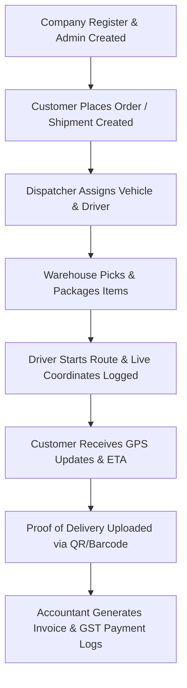

# LogiFlow - Project Requirements & Business Flow

This document details the functional specifications, business flows, user roles, folder structure, and deployment strategies for **LogiFlow - Enterprise Logistics Management System**.

---

## 1. Business Flow

LogiFlow supports a multi-tenant enterprise logistics operation. The flow operates as follows:



1. **Onboarding:** A new logistics/transport company registers, creating their primary Company Account and the Super/Company Admin.
2. **Order Placement:** Customers create cargo/shipment requests with specific quantities, weights, dimensions, pickup/drop-off addresses, and item details.
3. **Dispatch & Allocation:** Dispatchers view all pending shipments, matching them with available Vehicles (based on capacity/type) and Drivers.
4. **Warehouse Processing:** Warehouse managers receive inventory notifications, section/rack assignments, and confirm incoming/outgoing cargo packages.
5. **Transit & GPS Tracking:** Drivers view assigned tasks on their mobile/web app. As they drive, coordinates are pushed (via WebSockets/background workers) to Redis and mapped on Google Maps/OSM.
6. **Delivery & POD:** Upon arrival, the driver scans a QR code/barcode on the package or gathers a digital signature. This transitions the shipment status to `DELIVERED`.
7. **Billing & Auditing:** The system automatically calculates tax/GST, applies discounts, and generates PDF invoices sent to the client. Every action is logged in an immutable audit ledger.

---

## 2. User Roles & Permission Matrix

LogiFlow implements strict Role-Based Access Control (RBAC).

| Role | Description | Core Permissions |
| :--- | :--- | :--- |
| **Super Admin** | Platform owner / SaaS operator | Manage all companies, system-wide settings, global audit logs |
| **Company Admin**| Logistics company owner | Manage company profile, billing subscription, users, roles, branches |
| **Dispatcher** | Coordinator of fleet & shipments | Create/modify shipments, assign drivers & vehicles, plan routes |
| **Warehouse Mgr**| Warehouse & inventory operator | Create section/rack layouts, track stock, scan incoming/outgoing items |
| **Driver** | Transport staff | View assigned shipments, update live GPS, upload POD, scan QR |
| **Accountant** | Financial staff | Generate/modify invoices, log payments, view tax/revenue reports |
| **Customer** | Client / Consignee | Book shipments, track live orders, download invoices |

---

## 3. Database Schema Blueprint

The Postgres database consists of 15 key relational tables:
* `companies`: Tenant profiles, subscriptions, GST info, settings.
* `roles` & `permissions`: RBAC authorization models.
* `users`: Profiles linked to a company, passwords, contact details.
* `customers`: Clients using the logistics service.
* `drivers`: Driver licensing, emergency contacts, status, and linked vehicles.
* `vehicles`: Fleet details (capacity, maintenance history, insurance, status).
* `warehouses`: Physical sites, section layouts, and rack information.
* `shipments`: Core logistics orders (tracking numbers, status workflows, source/destination).
* `shipment_items`: Items nested under a shipment (dimensions, weight, quantity).
* `shipment_tracking`: Historical geographic coordinates and status changes.
* `payments` & `invoices`: Financial records, invoices (PDF path, GST breakdown).
* `notifications`: Channels (email, SMS, push) and trigger events.
* `audit_logs`: Immutable security records tracking who did what and when.

---

## 4. System Directory Layout

```
logiflow/
├── backend/
│   ├── app/
│   │   ├── api/             # API Router layers (v1, deps, endpoints)
│   │   ├── core/            # Configuration, Security, JWT, Logging, Celery
│   │   ├── db/              # SQLAlchemy sessions and base models
│   │   ├── models/          # Relational DB models
│   │   ├── schemas/         # Pydantic schemas (validation)
│   │   └── services/        # Business logic & repository layers
│   ├── tests/               # Pytest suites
│   ├── alembic/             # Migration scripts
│   ├── Dockerfile
│   └── pyproject.toml
├── frontend/
│   ├── src/
│   │   ├── assets/          # Static files, images
│   │   ├── components/      # UI components (shadcn/ui, sidebar, layout)
│   │   ├── core/            # API client (Axios/TanStack), contexts, hooks
│   │   ├── features/        # Feature modules (auth, dashboard, shipments)
│   │   └── main.tsx
│   ├── postcss.config.js
│   ├── tailwind.config.js
│   ├── vite.config.ts
│   └── Dockerfile
├── nginx/
│   └── default.conf         # Reverse proxy configuration
├── docker-compose.yml       # Dev orchestration
└── README.md
```

---

## 5. Deployment Strategy

* **Development:** Orchestrated using `docker-compose.yml` locally, hosting FastAPI, PostgreSQL, Redis, Celery, and Vite.
* **Production:**
  * **CI/CD:** GitHub Actions workflows building Docker images and running tests.
  * **Registry:** AWS Elastic Container Registry (ECR).
  * **Orchestration:** AWS ECS (Elastic Container Service) with Fargate or Kubernetes (EKS).
  * **Storage:** RDS (PostgreSQL), ElastiCache (Redis), S3 (PDF Invoices & Document Uploads).
  * **Proxy & SSL:** Nginx acting as a reverse proxy with Let's Encrypt SSL certificates.
